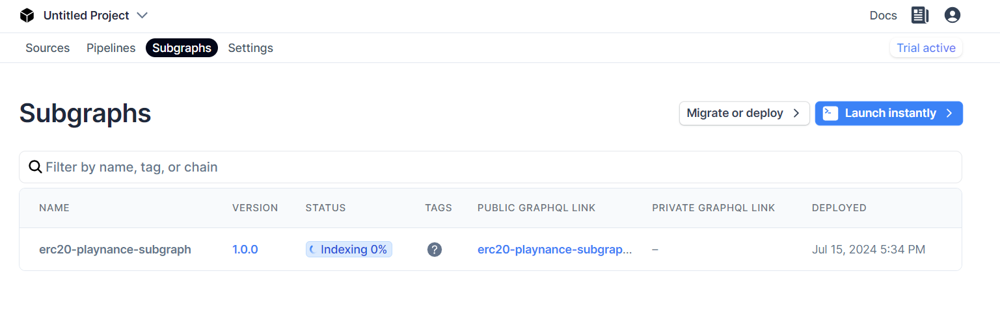
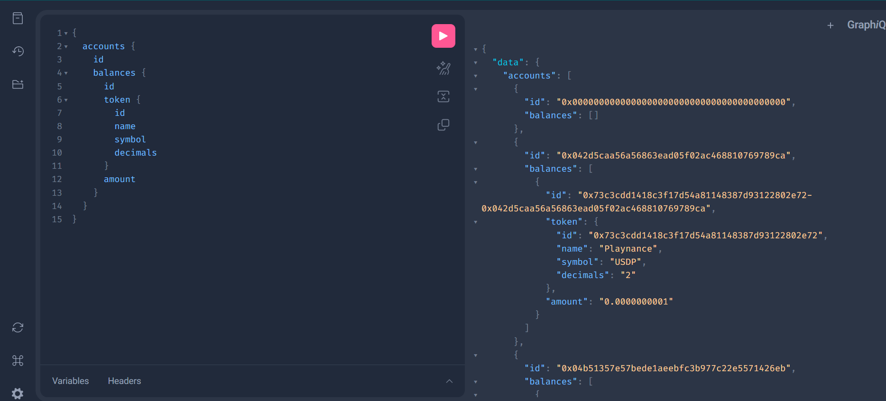

# Index & Query Arbitrum Blueberry Data with Goldsky

An example using the [Goldsky](https://goldsky.com/) SDK to index Arbitrum Blueberry blockchain data. Specifically, this repo provides subgraph code for indexing user ERC20 token balances.

👉 Try the [demo](https://api.goldsky.com/api/public/project_clymupzv0k3g60108c9f2eflb/subgraphs/erc20-playnance-subgraph/1.0.0/gn)
👉 Read the Goldsky [developer docs](https://docs.goldsky.com/introduction)
👉 Contract creation of ERC20 on block explorer [here](https://arb-blueberry.gelatoscout.com/tx/0x24b66e359f37e59e78e11e8b583da45013af14b9f7d1739206fa67a88d40b4ac)

## Requirements

- Nodejs `v20.11.0` or greater
- pnpm (or another preferred package manager)

## Quick Setup

### Step 1 - Install dependencies

```bash
# FROM: ./goldsky-subgraph

npm install;
```

### Step 2 - Set up Goldsky

1. Create an account at [app.goldsky.com](https://app.goldsky.com)
2. Create an API key on the Settings page
3. Install the Goldsky CLI:

```bash
curl https://goldsky.com | sh
```

4. Log in with the API key created earlier:

```bash
goldsky login
```

## Step 3 - Generate Types and Build Subgraph

Before deploying the subgraph, you need to generate the necessary types and build the subgraph:

```bash
# FROM: ./goldsky-subgraph

# Generate types from the GraphQL schema and the subgraph manifest
graph codegen

# Compile the subgraph and prepare it for deployment
graph build
```

### Step 4 - Deploy Subgraph

```bash
# FROM: ./goldsky-subgraph

goldsky subgraph deploy erc20-playnance-subgraph/1.0.0 --path .
```

### Step 5 - Query the Subgraph

After your subgraph has finished indexing, navigate to your public GraphQL link and try the following query:

```
{
  accounts {
    id
    balances {
      id
      token {
        id
        name
        symbol
        decimals
      }
      amount
    }
  }
}
```



### Result

You can now query the subgraph in the GraphQL playground to retrieve user ERC20 token balances.


